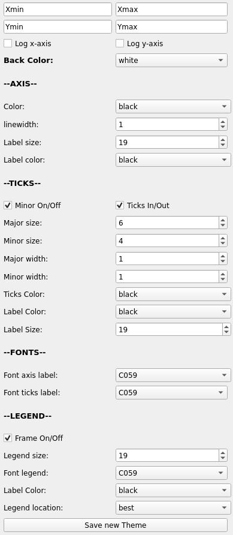

.. VcatPy documentation master file, created by
   sphinx-quickstart on Fri Mar  9 22:59:43 2018.
   You can adapt this file completely to your liking, but it should at least
   contain the root `toctree` directive.
.. _custom:

|python| |Python36|  |Licence|
|matplotlib| |PyQt5| |numpy| |scipy| 

.. |Licence| image:: https://img.shields.io/badge/License-GPLv3-blue.svg
      :target: http://perso.crans.org/besson/LICENSE.html

.. |Opensource| image:: https://badges.frapsoft.com/os/v1/open-source.svg?v=103
      :target: https://github.com/ellerbrock/open-source-badges/

.. |python| image:: https://img.shields.io/badge/Made%20with-Python-1f425f.svg
    :target: https://www.python.org/downloads/release/python-360/

.. |PyQt5| image:: https://img.shields.io/badge/poweredby-PyQt5-orange.svg
   :target: https://pypi.python.org/pypi/PyQt5

.. |matplotlib| image:: https://img.shields.io/badge/poweredby-matplotlib-orange.svg
   :target: https://matplotlib.org/

.. |Python36| image:: https://img.shields.io/badge/python-3.6-blue.svg
.. _Python36: https://www.python.org/downloads/release/python-360/

.. |numpy| image:: https://img.shields.io/badge/poweredby-numpy-orange.svg
   :target: http://www.numpy.org/

.. |scipy| image:: https://img.shields.io/badge/poweredby-scipy-orange.svg
   :target: https://www.scipy.org/

Available Graphical customization
---------------------------------
---------------------------------

Photon allows you to customize your plot in many different aspects. This page will show what options you can use.

    Customization related widgets.

All the options are displayed in the figure on the right and we will detail them here.

Axis limits
~~~~~~~~~~~
The four first boxes (with 'Xmin','Xmax', 'Ymin' and 'Ymax') are made to constrain the axis limits of the plot. Of course, Xmax>Xmin and Ymax>Ymin. 
To make it work you must fill all the boxes. 
If you only enter one Photon will not recognize it as a valid configuration and will set the constraints by itself to 0,1;0,1.
Also you can choose to transform the x and y axis into log-scales. In order to do this you must check the Logx and/or Logy checkboxes.

Background color
~~~~~~~~~~~~~~~~
The two widget about the background color (Label widget with 'back color', and color list) allow you to change the color of the background of your plot.

Axis properties
~~~~~~~~~~~~~~~
The program also let you play with the axis and their labels. 
This is done in the AXIS section. Here you can change the color of the axis, and the color of their labels as well. 
The tickness of the axis lines is controlled by the *linewidth* widget and the size of the labels is 
managed by the *Label size* widget. 

Ticks properties
~~~~~~~~~~~~~~~~
The properties of the ticks in the plot are controlled in the TICKS section. 
This section starts with 2 checkboxes.
The first will add or remove the minorticks while the second will place them inside or outside.
The four next widgets let you manage the length and width of the major and minor ticks (*Major size*, *Minor size*, *Major width*, *Minor width*).
Then you can control the color of the ticks using the *Ticks color* widget as well as the color of the ticks labels with *Label Color*.
Finally, the size of the ticks labels is modified with the *Label Size* widget.

Fonts
~~~~~
The section FONTS will let you choose the font used by the labels. 
You can change both axis and ticks label fonts using *Font axis Label* and *Font ticks Label*, respectively. The fonts that you can use depends entirely on your system as Photon is asking Matplotlib what fonts are available (the font list is not hardcoded).  

Legend
~~~~~~
The LEGEND section help you to customize the legend of your plot. You have 4 options.
The frame of the legend (box around the legend) can be turned On/Off with the first checkbox of the section.
The legend size can also be modified using the *Legend Size* widget (this will modify the fontsize of the text in the legend).
The font can also be changed using the *Font Legend* properties.
The color of the text in the legend can be changed using the *Label color* widget. 
Finally, the legend position can be changed using the *Legend Location* widget. To let the legend be automatically placed you just have to choose 'best'. If you want it in a special place (9 possibilities) you can chose in the list what fits best for your plot.

Save the customization
~~~~~~~~~~~~~~~~~~~~~~
Changing the configuration each time can become bothersome. 
If you want to keep the same style for all your plots you can save all the custom options in a configuration file. 
Once you are happy with your configuration, press the 'Save new theme' button and it will open a file saving
dialog window. Here you enter the name of the configuration you want to save (like in any other program).

The Photon customization file look like this:

.. code-block:: shell

    [background]
    back_color = white

    [AXIS]
    color = black
    label_color = black
    linewidth = 1
    labelsize = 17
    axis_label_font = DejaVu Math TeX Gyre

    [TICKS]
    minor = on
    placement = in
    major_size = 6
    minor_size = 4
    major_width = 1
    minor_width = 1
    ticks_color = black
    label_color = black
    label_size = 17
    ticks_label_font = DejaVu Math TeX Gyre

    [LEGEND]
    frame = On
    font_size = 15
    legend_font = DejaVu Math TeX Gyre
    label_font_color = black

As shown in the page :doc:`usage`, you can then load directly Photon using this configuration with the -c
conf.file option.
